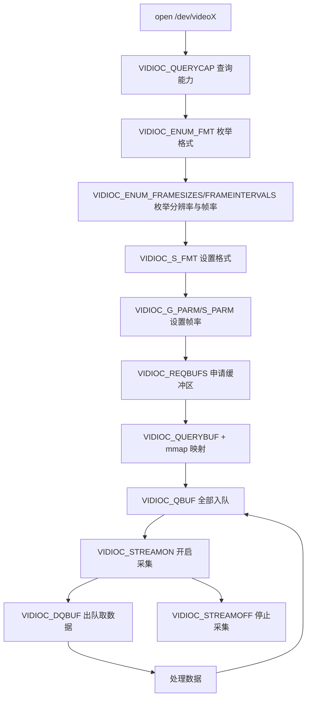

# V4L2（Video for Linux 2）学习笔记

---

# 1. V4L2 是什么

**V4L2（Video for Linux Two）** 是 Linux 内核提供的**视频设备驱动框架**，用于统一管理摄像头、视频采集卡、调频/编解码等设备。

核心思想：

> 应用程序通过打开 `/dev/videoX` 设备节点，使用 `ioctl()` 与驱动交互，完成**格式协商、缓冲区申请、数据采集**。
> 采集到的数据放在内核缓冲区中，通过 `mmap()` 映射到用户空间直接读取，避免拷贝。

典型设备节点：

```text
/dev/video0   # 第一个视频设备
/dev/video1   # 第二个视频设备
```

查看设备：

```bash
ls /dev/video*
v4l2-ctl --list-devices          # 需要安装 v4l2-utils
v4l2-ctl -d /dev/video0 --all    # 查看设备全部能力
```

---

# 2. 核心概念

| 概念 | 说明 | 常见取值 |
|------|------|----------|
| **设备类型** `type` | 缓冲区/流的类型 | `V4L2_BUF_TYPE_VIDEO_CAPTURE`（采集） |
| **内存类型** `memory` | 数据交互方式 | `V4L2_MEMORY_MMAP`（内存映射）<br>`V4L2_MEMORY_USERPTR`（用户指针）<br>`V4L2_MEMORY_DMABUF` |
| **像素格式** `pixelformat` | 每像素编码方式 | `V4L2_PIX_FMT_RGB565`<br>`V4L2_PIX_FMT_YUYV`<br>`V4L2_PIX_FMT_MJPEG` |
| **帧缓冲** | 内核中存放一帧图像的内存 | 数量由 `count` 指定，本示例为 3 |

**采集缓冲（buffer）四步生命周期：**

```text
REQBUFS 申请 → QUERYBUF 查询 + mmap 映射 → QBUF 入队 → DQBUF 出队处理 → QBUF 重新入队
```

- **入队（QBUF）**：把空缓冲区交给驱动，驱动采集数据后填入。
- **出队（DQBUF）**：取出驱动已填好数据的缓冲区（阻塞直到有数据）。处理完必须重新入队，形成循环。

---

# 3. 使用流程（打开 → 采集）



**标准步骤顺序：**

1. **打开设备**：`open(device, O_RDWR)`
2. **查询能力**：`VIDIOC_QUERYCAP` — 确认是采集设备（`V4L2_CAP_VIDEO_CAPTURE`）
3. **枚举格式**（可选）：`VIDIOC_ENUM_FMT` 列出支持的像素格式、分辨率、帧率
4. **设置格式**：`VIDIOC_S_FMT` — 设置宽、高、像素格式
5. **设置帧率**（可选）：`VIDIOC_G_PARM` + `VIDIOC_S_PARM`
6. **申请缓冲区**：`VIDIOC_REQBUFS` — 指定数量和 `V4L2_MEMORY_MMAP`
7. **查询并映射**：`VIDIOC_QUERYBUF` 获取长度与偏移，再 `mmap()`
8. **入队**：对所有缓冲区执行 `VIDIOC_QBUF`
9. **开启采集**：`VIDIOC_STREAMON`
10. **循环采集**：`VIDIOC_DQBUF` → 处理 → `VIDIOC_QBUF`（重复）
11. **停止/释放**：`VIDIOC_STREAMOFF`、`munmap()`、`close()`

---

# 4. 关键结构体

## 4.1 `struct v4l2_capability` — 设备能力

```c
struct v4l2_capability {
    __u8   driver[16];       // 驱动名
    __u8   card[32];         // 设备名
    __u8   bus_info[32];     // 总线信息
    __u32  version;          // 内核版本
    __u32  capabilities;     // 设备能力位掩码
    __u32  device_caps;
};
```

判断采集设备：

```c
if (!(V4L2_CAP_VIDEO_CAPTURE & cap.capabilities)) { /* 不是采集设备 */ }
```

## 4.2 `struct v4l2_fmtdesc` — 像素格式描述

```c
struct v4l2_fmtdesc {
    __u32 index;             // 序号，从 0 递增
    __u32 type;              // V4L2_BUF_TYPE_VIDEO_CAPTURE
    __u32 flags;
    __u8  description[32];   // 描述字符串
    __u32 pixelformat;       // 像素格式（如 V4L2_PIX_FMT_RGB565）
};
```

## 4.3 `struct v4l2_format` — 帧格式

```c
struct v4l2_format {
    __u32 type;
    union {
        struct v4l2_pix_format pix;   // 采集用这个
        /* ... */
    } fmt;
};

struct v4l2_pix_format {
    __u32 width;            // 宽
    __u32 height;           // 高
    __u32 pixelformat;      // 像素格式
    __u32 field;
    __u32 bytesperline;     // 每行字节数
    __u32 sizeimage;        // 一帧图像大小
    /* ... */
};
```

> **注意**：`VIDIOC_S_FMT` 后要先检查 `fmt.fmt.pix.pixelformat` 是否被驱动改回，
> 若与请求不同，说明设备不支持该格式。

## 4.4 `struct v4l2_requestbuffers` — 申请缓冲区

```c
struct v4l2_requestbuffers {
    __u32 count;             // 缓冲区数量
    __u32 type;              // V4L2_BUF_TYPE_VIDEO_CAPTURE
    __u32 memory;            // V4L2_MEMORY_MMAP
};
```

## 4.5 `struct v4l2_buffer` — 缓冲区信息

```c
struct v4l2_buffer {
    __u32 index;             // 缓冲区序号
    __u32 type;
    __u32 bytesused;         // 已用字节数
    __u32 length;            // 缓冲区长度
    __u32 memory;
    union {
        __u32 offset;        // mmap 时的偏移（m.offset）
        /* ... */
    } m;
};
```

## 4.6 `struct v4l2_streamparm` — 码流参数（帧率）

```c
struct v4l2_streamparm {
    __u32 type;
    union {
        struct v4l2_captureparm capture;
        /* ... */
    } parm;
};

struct v4l2_captureparm {
    __u32 capability;                            // 含 V4L2_CAP_TIMEPERFRAME 表示支持设帧率
    struct v4l2_fract timeperframe;              // 帧间隔 = numerator/denominator
    /* ... */
};
```

设置 30fps：`numerator = 1; denominator = 30;`

---

# 5. 关键 ioctl 命令速查

| 命令 | 作用 | 对应结构体 |
|------|------|-----------|
| `VIDIOC_QUERYCAP` | 查询设备能力 | `v4l2_capability` |
| `VIDIOC_ENUM_FMT` | 枚举像素格式 | `v4l2_fmtdesc` |
| `VIDIOC_ENUM_FRAMESIZES` | 枚举分辨率 | `v4l2_frmsizeenum` |
| `VIDIOC_ENUM_FRAMEINTERVALS` | 枚举帧间隔（帧率） | `v4l2_frmivalenum` |
| `VIDIOC_G_FMT` / `VIDIOC_S_FMT` | 获取/设置帧格式 | `v4l2_format` |
| `VIDIOC_G_PARM` / `VIDIOC_S_PARM` | 获取/设置码流参数 | `v4l2_streamparm` |
| `VIDIOC_REQBUFS` | 申请缓冲区 | `v4l2_requestbuffers` |
| `VIDIOC_QUERYBUF` | 查询缓冲区（长度、偏移） | `v4l2_buffer` |
| `VIDIOC_QBUF` | 入队 | `v4l2_buffer` |
| `VIDIOC_DQBUF` | 出队（阻塞取帧） | `v4l2_buffer` |
| `VIDIOC_STREAMON` | 开始采集 | `enum v4l2_buf_type` |
| `VIDIOC_STREAMOFF` | 停止采集 | `enum v4l2_buf_type` |

---

# 6. 本示例代码结构（`V4L2.c`）

程序功能：**摄像头采集 RGB565 图像 → 显示到 LCD（/dev/fb0）**

## 6.1 关键全局变量

```c
static int width, height;                      // LCD 宽高（来自 fb）
static unsigned short *screen_base;            // LCD 显存基地址（mmap 得到）
static int fb_fd, v4l2_fd;                     // LCD、摄像头文件描述符
static cam_buf_info buf_infos[3];              // 3 个摄像头帧缓冲信息
static cam_fmt cam_fmts[10];                   // 支持的格式列表
static int frm_width, frm_height;              // 视频帧宽高（实际生效值）
```

自定义结构体：

```c
typedef struct cam_buf_info {
    unsigned short *start;   // 帧缓冲起始地址（mmap）
    unsigned long   length;  // 帧缓冲长度
} cam_buf_info;

typedef struct camera_format {
    unsigned char description[32];  // 描述
    unsigned int  pixelformat;      // 像素格式
} cam_fmt;
```

## 6.2 关键函数

| 函数 | 职责 | 主要 ioctl |
|------|------|-----------|
| `fb_dev_init()` | 初始化 LCD：打开、取参数、mmap 显存、刷白 | `FBIOGET_VSCREENINFO` / `FBIOGET_FSCREENINFO` |
| `v4l2_dev_init()` | 打开摄像头并确认采集能力 | `VIDIOC_QUERYCAP` |
| `v4l2_enum_formats()` | 枚举支持格式存入 `cam_fmts[]` | `VIDIOC_ENUM_FMT` |
| `v4l2_print_formats()` | 打印格式、分辨率、帧率 | `VIDIOC_ENUM_FRAMESIZES` / `VIDIOC_ENUM_FRAMEINTERVALS` |
| `v4l2_set_format()` | 设置 RGB565、分辨率，并设置 30fps | `VIDIOC_S_FMT` / `VIDIOC_G_PARM` / `VIDIOC_S_PARM` |
| `v4l2_init_buffer()` | 申请缓冲、mmap、全部入队 | `VIDIOC_REQBUFS` / `VIDIOC_QUERYBUF` / `VIDIOC_QBUF` |
| `v4l2_stream_on()` | 开启采集 | `VIDIOC_STREAMON` |
| `v4l2_read_data()` | 死循环：出队取帧 → 拷到 LCD → 重新入队 | `VIDIOC_DQBUF` / `VIDIOC_QBUF` |

## 6.3 `main()` 调用顺序

```text
fb_dev_init()        // 初始化 LCD
v4l2_dev_init()      // 初始化摄像头
v4l2_enum_formats()  // 枚举格式
v4l2_print_formats() // 打印能力
v4l2_set_format()    // 设置格式 + 帧率
v4l2_init_buffer()   // 申请/映射/入队
v4l2_stream_on()     // 开启采集
v4l2_read_data()     // 循环采集并显示
```

---

# 7. 关键代码片段说明

## 7.1 内存映射缓冲区

```c
ioctl(v4l2_fd, VIDIOC_QUERYBUF, &buf);
buf_infos[i].length = buf.length;
buf_infos[i].start  = mmap(NULL, buf.length,
                           PROT_READ | PROT_WRITE, MAP_SHARED,
                           v4l2_fd, buf.m.offset);
```

> `mmap` 的 `offset` 必须用 `buf.m.offset`（内核分配的偏移），映射后即可直接读像素。

## 7.2 采集循环（生产者-消费者）

```c
for (;;) {
    for (i = 0; i < FRAMEBUFFER_COUNT; i++) {
        ioctl(v4l2_fd, VIDIOC_DQBUF, &buf);   // 出队：等一帧数据
        /* ...把 buf 数据拷贝到 LCD... */
        ioctl(v4l2_fd, VIDIOC_QBUF, &buf);    // 入队：还回给驱动
    }
}
```

## 7.3 显示拷贝（RGB565 每像素 2 字节）

```c
for (j = 0, base = screen_base, start = buf_infos[buf.index].start;
     j < min_h; j++) {
    memcpy(base,  start,  min_w * 2); // 拷一行
    base  += width;                   // LCD 下一行
    start += frm_width;               // 视频下一行
}
```

> `min_w`/`min_h` 取 LCD 与视频帧的较小值，防止越界；行步长不同，需逐行拷贝。

---

# 8. 编译与运行

```bash
# 交叉编译（示例）
arm-linux-gnueabihf-gcc V4L2.c -o V4L2

# 拷贝到开发板后运行
./V4L2 /dev/video0
```

- 参数：`<video_dev>` 摄像头设备节点。
- 依赖：内核开启 V4L2、LCD 驱动（`/dev/fb0`），两者像素格式一致（RGB565）。

---

# 9. 常见问题

| 现象 | 原因/排查 |
|------|-----------|
| 设备不支持 RGB565 | `VIDIOC_S_FMT` 后 `pixelformat` 被改，需换格式或做转换（YUYV→RGB） |
| `VIDIOC_DQBUF` 阻塞不返回 | 未 STREAMON，或没有缓冲区入队 |
| 图像花屏/错位 | 视频帧与 LCD 行宽不一致，需逐行拷贝；检查 `bytesperline` |
| `mmap` 失败 | `VIDIOC_REQBUFS` 的 `count` 为 0，或 memory 类型不支持 |
| 采集卡顿 | 缓冲区过少，可增大 `count`；处理耗时长导致丢帧 |
