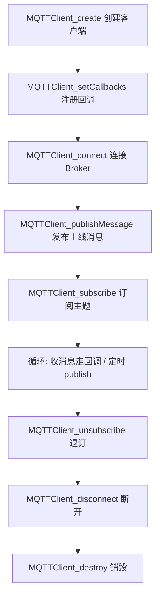

# 1. MQTT 是什么

**MQTT（Message Queuing Telemetry Transport）** 是基于 **TCP/IP** 的**轻量级发布/订阅消息协议**，为低带宽、不稳定网络下的物联网设备设计。

核心思想：

> 客户端不直接通信，而是通过中间的 **Broker（代理服务器）** 转发消息。
> 生产者把消息 **publish** 到某个 **topic**，消费者 **subscribe** 该 topic 即可收到，双方完全解耦。
> 一条消息可以被多个订阅者同时收到（一对多）。

三个角色：

```text
Publisher（发布者） ──publish──▶ Broker（消息代理） ──push──▶ Subscriber（订阅者）
```

常用端口：`1883`（明文）/ `8883`（TLS）。

---

# 2. 核心概念

| 概念 | 说明 |
|------|------|
| **Broker** | 消息中转服务器，如 mosquitto、EMQX。地址格式 `tcp://host:1883` |
| **Topic** | 消息主题，用 `/` 分层，如 `zr/led`、`home/room1/temp` |
| **ClientID** | 客户端唯一标识，同一 ID 重复连接会踢掉前一个 |
| **QoS** | 消息可靠等级，见下表 |
| **Retain** | 保留消息。Broker 保存该主题**最后一条**消息，新订阅者一订阅立即收到 |
| **Will（遗嘱）** | 客户端**异常断开**时，由 Broker 代发的预设消息，用于掉线告警 |
| **Keep Alive** | 心跳间隔（秒）。超过 1.5 倍时间无报文，Broker 判定掉线并发布遗嘱 |
| **Clean Session** | `1` 每次全新会话；`0` Broker 保存订阅关系与未确认消息，重连后恢复 |

**QoS 三档：**

| QoS | 语义 | 特点 |
|-----|------|------|
| 0 | 最多一次 | 发完即忘，可能丢失，最快 |
| 1 | 至少一次 | 有确认，可能重复 |
| 2 | 恰好一次 | 两次握手，不丢不重，最慢 |

**通配符（仅订阅端可用）：**

```text
+   单层通配    home/+/temp     匹配 home/room1/temp
#   多层通配    home/#          匹配 home 下所有主题
```

---

# 2.1 Clean Session 详解

**Clean Session（清除会话）** 是 CONNECT 报文中的一个标志位，决定**本次连接是否复用 Broker 上以该 ClientID 保存的旧会话**。

> 关键：会话状态是**绑定在 ClientID 上**的，不是绑定在 TCP 连接上的。
> 所以 Clean Session 只对「同一个 ClientID 再次连接」有意义。

| 取值 | 名字 | 连接时 | 断开后 |
|------|------|--------|--------|
| `1`（true） | Clean Session | **丢弃**该 ClientID 的旧会话，从零开始 | Broker **不保存**本次会话，立即删除 |
| `0`（false） | 持久会话 | **复用**旧会话（若存在），否则新建 | Broker **保存**会话，等下次同 ID 连接 |

**Broker 保存的「会话状态」包含三样东西：**

| 内容 | 说明 |
|------|------|
| 订阅列表 | 该客户端订阅过哪些 topic（**这是最实用的部分**） |
| QoS 1/2 的未确认消息 | 已发出但未收到 PUBACK/PUBREC 的消息 |
| QoS 1/2 的待收消息 | 离线期间别人发给它的消息，重连后补发 |

注意：**QoS 0 的消息永远不会被保存**，离线期间的 QoS 0 消息直接丢弃。

**典型场景对比：**

```text
场景：设备订阅 zr/led，然后掉线，之后重连

cleansession = 0（持久会话）
  订阅时 Broker 记住 zr/led
  掉线期间有人发 "1" 到 zr/led  → Broker 缓存
  重连后：不需要重新 subscribe，直接收到缓存的 "1"

cleansession = 1（清除会话）
  掉线后 Broker 立刻忘掉订阅和缓存
  重连后：必须重新调用 subscribe，掉线期间的消息全部丢失
```

**怎么选：**

| 场景 | 建议 | 原因 |
|------|------|------|
| 传感器定期上报，不需要补发历史 | `1` | 无状态、省 Broker 内存 |
| 控制指令不能丢（如开关灯命令） | `0` | 重连后仍能收到离线指令 |
| ClientID 是随机/临时的 | `1` | 否则 Broker 上积累大量僵尸会话 |
| 手机 App 短暂切网 | `0` | 免去重新订阅，丝滑重连 |

**两个必须知道的坑：**

1. **`cleansession = 0` 时 ClientID 必须固定且全局唯一。** 若同时用随机 ID，每次都是新会话，等于白设；若两台设备用同一 ID，会互相顶掉连接。
2. **改过订阅后要留意残留会话。** 若之前用 `0` 订阅了 A 主题，后来只想订阅 B 主题，旧会话里的 A 订阅仍存在——需要先用 `cleansession = 1` 连一次清干净。

**本项目（`mqttClient.c`）中：**

```c
conn_opts.cleansession = 0;   // 持久会话
```

配合固定的 `CLIENTID "zr-arm"`，因此程序重启后**仍保留原来的订阅关系**，Broker 还可能把掉线期间的主题消息补发过来。但代码里同时开启了遗嘱：

```c
will_opts.message = "Unexpected disconnection";
```

遗嘱只在**异常断线**（TCP 断开、心跳超时）时发布；正常调用 `MQTTClient_disconnect` 会发送 DISCONNECT 报文，Broker 知道是主动离开，**不会发布遗嘱**。

---

# 3. 使用流程（paho.mqtt.c）



要点：

- `create` 和 `connect` 分两步，中间可注册回调、配置遗嘱/账号密码。
- 收到消息、连接丢失**都在回调线程中执行**，回调里不要做耗时阻塞操作。
- 回调中收到的 `message` 和 `topicName` **必须手动释放**（`MQTTClient_freeMessage` + `MQTTClient_free`）。
- 所有 API 返回 `MQTTCLIENT_SUCCESS`（0）表示成功，否则打印返回码排查。

---

# 4. 关键函数

| 函数 | 作用 |
|------|------|
| `MQTTClient_create(&client, addr, id, persistence, NULL)` | 创建客户端对象，`PERSISTENCE_NONE` 为不落盘 |
| `MQTTClient_setCallbacks(c, ctx, connlost, msgarrvd, delivered)` | 注册连接丢失、消息到达、投递完成回调 |
| `MQTTClient_connect(c, &conn_opts)` | 连接 Broker，超时/拒绝返回对应错误码 |
| `MQTTClient_publishMessage(c, topic, &msg, &token)` | 发布消息，`token` 传 `NULL` 表示同步等待完成 |
| `MQTTClient_subscribe(c, topic, qos)` | 订阅主题 |
| `MQTTClient_unsubscribe(c, topic)` | 退订 |
| `MQTTClient_disconnect(c, timeout_ms)` | 断开连接，等待未完成消息发送完毕 |
| `MQTTClient_destroy(&client)` | 释放客户端对象 |
| `MQTTClient_freeMessage(&msg)` / `MQTTClient_free(topic)` | 释放回调中收到的内存 |

**回调原型：**

```c
/* 消息到达：返回 1 表示消息已被处理 */
int  msgarrvd(void *context, char *topicName, int topicLen, MQTTClient_message *message);

/* 连接丢失 */
void connlost(void *context, char *cause);
```

**链接库对应关系：**

| 库 | API | 说明 |
|----|-----|------|
| `-lpaho-mqtt3c` | `MQTTClient_*` | 同步 API（本项目使用） |
| `-lpaho-mqtt3a` | `MQTTAsync_*` | 异步 API，全回调 |

---

# 5. 关键结构体

所有结构体都要用对应的 **`_initializer` 宏初始化**，否则内部字段是随机值：

```c
MQTTClient_connectOptions conn_opts = MQTTClient_connectOptions_initializer;
MQTTClient_willOptions    will_opts = MQTTClient_willOptions_initializer;
MQTTClient_message        pubmsg    = MQTTClient_message_initializer;
```

**`MQTTClient_connectOptions`** —— 连接参数：

| 字段 | 说明 |
|------|------|
| `keepAliveInterval` | 心跳间隔（秒） |
| `cleansession` | 0 保存会话 / 1 全新会话 |
| `will` | 指向遗嘱结构体的指针 |
| `username` / `password` | 账号密码，无认证可不填 |

**`MQTTClient_willOptions`** —— 遗嘱参数：

| 字段 | 说明 |
|------|------|
| `topicName` | 遗嘱主题 |
| `message` | 遗嘱内容 |
| `retained` | 是否保留 |
| `qos` | 遗嘱 QoS |

**`MQTTClient_message`** —— 消息内容：

| 字段 | 说明 |
|------|------|
| `payload` | 数据首地址（**不一定以 `\0` 结尾**） |
| `payloadlen` | 数据长度，**必须准确填写** |
| `qos` | 服务质量等级 |
| `retained` | 是否保留消息 |

---

# 6. 常见踩坑

1. **payload 不是字符串**：`message->payload` 只保证 `payloadlen` 字节有效，直接 `strcmp` 可能越界，应先拷贝到本地并补 `\0`，或按长度比较。
2. **payloadlen 写错**：`"Online"` 是 6 字节（不含结尾 `\0`），长度少算会截断、多算会发垃圾数据。
3. **忘记释放回调内存**：`msgarrvd` 中必须调 `MQTTClient_freeMessage` 和 `MQTTClient_free`。
4. **Clean Session 用 0 时 ClientID 要固定**，否则 Broker 上会话无法恢复。
5. **QoS 与订阅不匹配**：实际 QoS 取「发布 QoS」和「订阅 QoS」的较小值。
6. **遗嘱只在异常断开时触发**：正常调用 `disconnect` 不会发送遗嘱。

---


